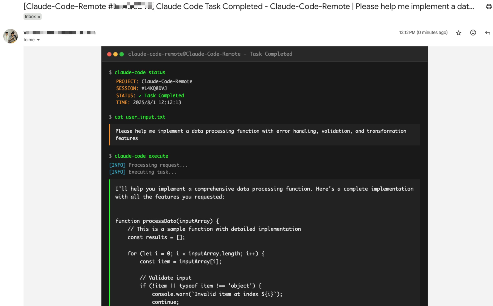

# Claude Code Remote

Control [Claude Code](https://claude.ai/code) remotely via email. Start tasks locally, receive notifications when Claude completes them, and send new commands by simply replying to emails.

<div align="center">
  
  ### 🎥 Watch Demo Video
  
  <a href="https://youtu.be/_yrNlDYOJhw">
    
    <br>
    
  </a>
  
</div>

> 🐦 Follow [@Jiaxi_Cui](https://x.com/Jiaxi_Cui) for updates and AI development insights

## ✨ Features

- **📧 Email Notifications**: Get notified when Claude completes tasks 
- **🔄 Email Control**: Reply to emails to send new commands to Claude
- **📱 Remote Access**: Control Claude from anywhere with just email
- **🔒 Secure**: Whitelist-based sender verification
- **📋 Multi-line Support**: Send complex commands with formatting


## 📅 Changelog

### August 2025
- **2025-08-01**: Implement terminal-style UI for email notifications ([#8](https://github.com/JessyTsui/Claude-Code-Remote/pull/8) by [@vaclisinc](https://github.com/vaclisinc))
- **2025-08-01**: Fix working directory issue - enable claude-remote to run from any directory ([#7](https://github.com/JessyTsui/Claude-Code-Remote/pull/7) by [@vaclisinc](https://github.com/vaclisinc))
### July 2025
- **2025-07-31**: Fix self-reply loop issue when using same email for send/receive ([#4](https://github.com/JessyTsui/Claude-Code-Remote/pull/4) by [@vaclisinc](https://github.com/vaclisinc))
- **2025-07-28**: Remove hardcoded values and implement environment-based configuration ([#2](https://github.com/JessyTsui/Claude-Code-Remote/pull/2) by [@kevinsslin](https://github.com/kevinsslin))

## 📋 TODO List

### Notification Channels
- [ ] **Discord & Telegram**: Bot integration for messaging platforms
- [ ] **Slack Workflow**: Native Slack app with slash commands

### Developer Tools
- [ ] **AI Tools**: Support for Gemini CLI, Cursor, and other AI tools
- [ ] **Git Automation**: Auto-commit, PR creation, branch management

### Usage Analytics
- [ ] **Cost Tracking**: Token usage and estimated costs
- [ ] **Performance Metrics**: Execution time and resource usage
- [ ] **Scheduled Reports**: Daily/weekly usage summaries via email

### Native Apps
- [ ] **Mobile Apps**: iOS and Android applications
- [ ] **Desktop Apps**: macOS and Windows native clients


## 🚀 Setup Guide

Follow these steps to get Claude Code Remote running:

### Step 1: Clone and Install Dependencies

```bash
git clone https://github.com/JessyTsui/Claude-Code-Remote.git
cd Claude-Code-Remote
npm install
```

### Step 2: Configure Email Settings

```bash
# Copy the example configuration
cp .env.example .env

# Open .env in your editor
nano .env  # or use vim, code, etc.
```

Edit the `.env` file with your email credentials:

```env
# Email account for sending notifications
SMTP_USER=your-email@gmail.com
SMTP_PASS=your-app-password    # Gmail: use App Password, not regular password

# Email account for receiving replies (can be same as SMTP)
IMAP_USER=your-email@gmail.com  
IMAP_PASS=your-app-password

# Where to send notifications
EMAIL_TO=your-notification-email@gmail.com

# Who can send commands (security whitelist)
ALLOWED_SENDERS=your-notification-email@gmail.com

# Path to session data (use absolute path)
SESSION_MAP_PATH=/your/absolute/path/to/Claude-Code-Remote/src/data/session-map.json
```

📌 **Gmail users**: Create an [App Password](https://myaccount.google.com/security) instead of using your regular password.
> Note: You may need to enable two-step verification in your google account first before create app password.

### Step 3: Set Up Claude Code Hooks

Open Claude's settings file:

```bash
# Create the directory if it doesn't exist
mkdir -p ~/.claude

# Edit settings.json
nano ~/.claude/settings.json
```

Add this configuration (replace `/your/absolute/path/` with your actual path):

```json
{
  "hooks": {
    "Stop": [{
      "matcher": "*",
      "hooks": [{
        "type": "command",
        "command": "node /your/absolute/path/to/Claude-Code-Remote/claude-remote.js notify --type completed",
        "timeout": 5
      }]
    }],
    "SubagentStop": [{
      "matcher": "*",
      "hooks": [{
        "type": "command",
        "command": "node /your/absolute/path/to/Claude-Code-Remote/claude-remote.js notify --type waiting",
        "timeout": 5
      }]
    }]
  }
}
```

> **Note**: Subagent notifications are disabled by default. To enable them, set `enableSubagentNotifications: true` in your config. See [Subagent Notifications Guide](./docs/SUBAGENT_NOTIFICATIONS.md) for details.

### Step 4: Test Your Setup

```bash
# Test email configuration
node claude-remote.js test
```

You should receive a test email. If not, check your email settings.

### Step 5: Start Claude Code Remote

**Terminal 1 - Start email monitoring:**
```bash
npm run relay:pty
```

Keep this running. You should see:
```
🚀 Claude Code Remote is running!
📧 Monitoring emails...
```

**Terminal 2 - Start Claude in tmux:**
```bash
# Create a new tmux session
tmux new-session -s my-project

# Inside tmux, start Claude
claude
```

### Step 6: You're Ready!

1. Use Claude normally in the tmux session
2. When Claude completes a task, you'll receive an email
3. Reply to the email with new commands
4. Your commands will execute automatically in Claude

### Verify Everything Works

In Claude, type:
```
What is 2+2?
```

Wait for Claude to respond, then check your email. You should receive a notification!

## 📖 How to Use

### Email Notifications
When Claude completes a task, you'll receive an email notification:

```
Subject: Claude Code Remote Task Complete [#ABC123]

Claude completed: "analyze the code structure"

[Claude's full response here...]

Reply to this email to send new commands.
```

### Sending Commands via Email Reply

1. **Direct Reply**: Simply reply to the notification email
2. **Write Command**: Type your command in the email body:
   ```
   Please refactor the main function and add error handling
   ```
3. **Send**: Your command will automatically execute in Claude!

### Advanced Email Features

**Multi-line Commands**
```
First analyze the current code structure.
Then create a comprehensive test suite.
Finally, update the documentation.
```

**Complex Instructions**
```
Refactor the authentication module with these requirements:
- Use JWT tokens instead of sessions
- Add rate limiting
- Implement refresh token logic
- Update all related tests
```

### Email Reply Workflow

1. **Receive Notification** → You get an email when Claude completes a task
2. **Reply with Command** → Send your next instruction via email reply
3. **Automatic Execution** → The system extracts your command and injects it into Claude
4. **Get Results** → Receive another email when the new task completes

### Supported Email Clients

Works with any email client that supports standard reply functionality:
- ✅ Gmail (Web/Mobile)
- ✅ Apple Mail
- ✅ Outlook
- ✅ Any SMTP-compatible email client

### Advanced Configuration

**Email Notification Options**

1. **Subagent Activities in Email**

   By default, email notifications only show the execution trace. You can optionally enable a separate subagent activities summary section:

   ```json
   // In your config/config.json
   {
     "showSubagentActivitiesInEmail": true  // Default: false
   }
   ```

   When enabled, emails will include:
   - **Subagent Activities Summary**: A structured list of all subagent activities
   - **Full Execution Trace**: The complete terminal output

   Since the execution trace already contains all information, this feature is disabled by default to keep emails concise.

2. **Execution Trace Display**

   You can control whether to include the execution trace in email notifications:

   ```json
   // In your email channel configuration
   {
     "email": {
       "config": {
         "includeExecutionTrace": false  // Default: true
       }
     }
   }
   ```

   - When `true` (default): Shows a scrollable execution trace section in emails
   - When `false`: Removes the execution trace section entirely from emails

   This is useful if you find the execution trace too verbose or if your email client has issues with scrollable content.

## 💡 Common Use Cases

- **Remote Development**: Start coding at the office, continue from home via email
- **Long Tasks**: Let Claude work while you're in meetings, check results via email
- **Team Collaboration**: Share Claude sessions by forwarding notification emails

## 🔧 Useful Commands

```bash
# Test email setup
node claude-remote.js test

# Check system status
node claude-remote.js status

# View tmux sessions
tmux list-sessions
tmux attach -t my-project

# Stop email monitoring
# Press Ctrl+C in the terminal running npm run relay:pty
```

## 🔍 Troubleshooting

**Not receiving emails?**
- Run `node claude-remote.js test` to test email setup
- Check spam folder
- Verify SMTP settings in `.env`
- For Gmail: ensure you're using App Password

**Commands not executing?**
- Ensure tmux session is running: `tmux list-sessions`
- Check sender email matches `ALLOWED_SENDERS` in `.env`
- Verify Claude is running inside tmux

**Need help?**
- Check [Issues](https://github.com/JessyTsui/Claude-Code-Remote/issues)
- Follow [@Jiaxi_Cui](https://x.com/Jiaxi_Cui) for updates

## 🛡️ Security

- ✅ **Sender Whitelist**: Only authorized emails can send commands
- ✅ **Session Isolation**: Each token controls only its specific session
- ✅ **Auto Expiration**: Sessions timeout automatically

## 🤝 Contributing

Found a bug or have a feature request? 

- 🐛 **Issues**: [GitHub Issues](https://github.com/JessyTsui/Claude-Code-Remote/issues)
- 🐦 **Updates**: Follow [@Jiaxi_Cui](https://x.com/Jiaxi_Cui) on Twitter
- 💬 **Discussions**: Share your use cases and improvements

## 📄 License

MIT License - Feel free to use and modify!

---

**🚀 Make Claude Code truly remote and accessible from anywhere!**

## ⭐ Star History

[](https://star-history.com/#JessyTsui/Claude-Code-Remote&Date)

⭐ **Star this repo** if it helps you code more efficiently!

> 💡 **Tip**: Share your remote coding setup on Twitter and tag [@Jiaxi_Cui](https://x.com/Jiaxi_Cui) - we love seeing how developers use Claude Code Remote!
